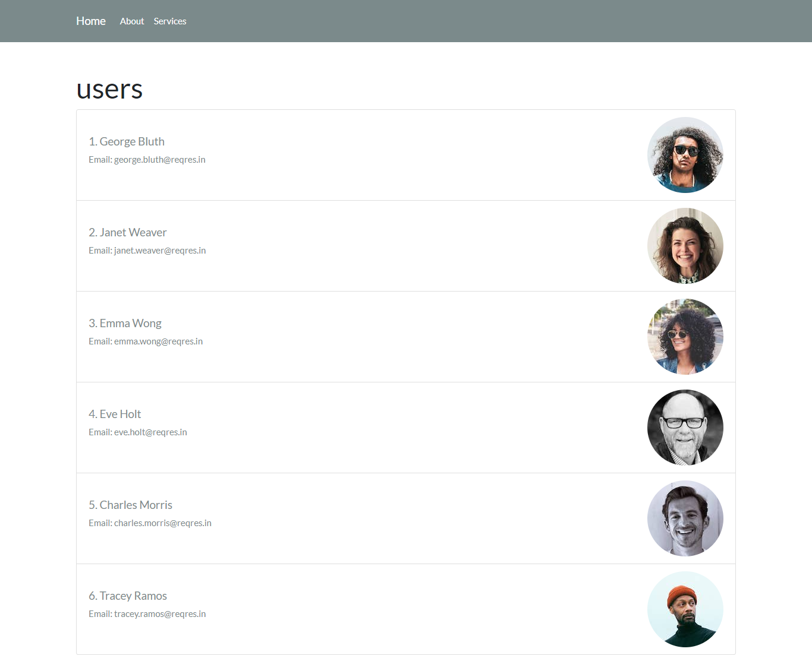

# Project ReactJS y NextJS 

This project was bootstrapped with [Next.js](https://nextjs.org/).

## Scripts

In the project directory, you can run:

### `npm install`

Download project dependencies

### `npm run dev`

Runs the app in the development mode.\
Open [http://localhost:3000](http://localhost:3000) to view it in your browser.

The page will reload when you make changes.\
You may also see any lint errors in the console.

# Screenshot

